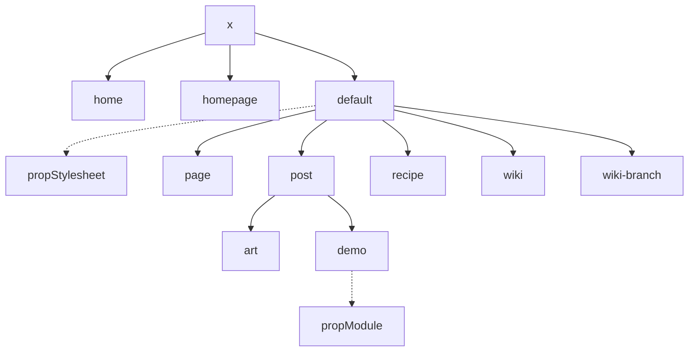

# Taush Sampley - Personal Static Site

This project consists of a Jekyll Site (_config.yml) using Ruby (Gemfile) as well as a Node project (package.json).

## Site Layouts

## Building

To build and serve locally with drafts: `bundle exec jekyll serve --trace --drafts`.

To deploy to GitHub Pages simply push to the main branch.
