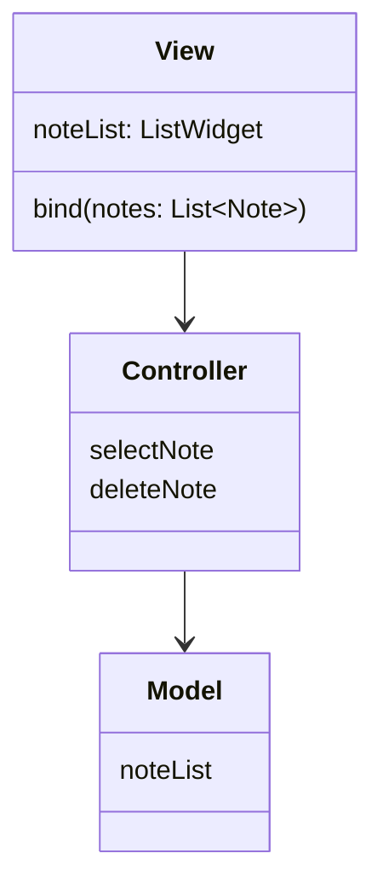
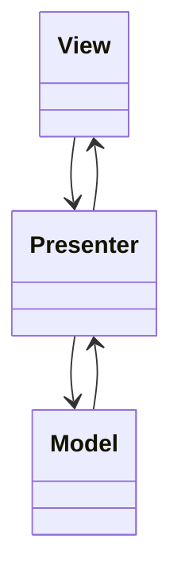
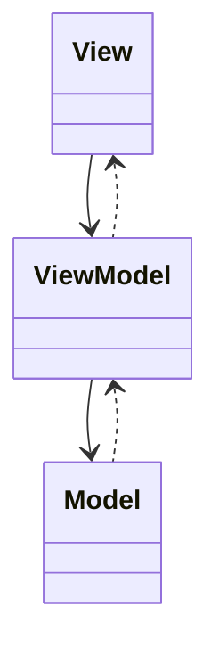
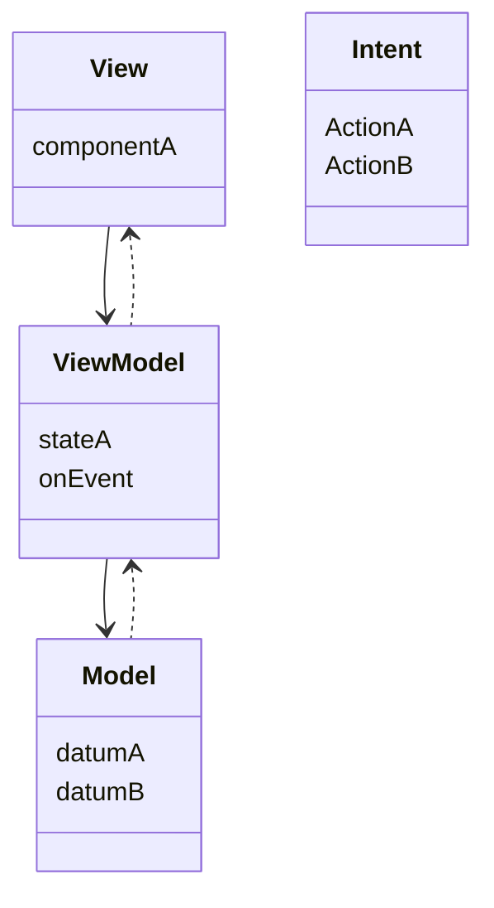

As someone who can't help but recontextualize things in the bigger picture, I've always been drawn to architecture since I started learning about it.

and I must say I am very troubled by the incredible number of very poor – and often plain wrong – tutorials and explanations.

## MVC

## MVP

## MVVM

### MVVM+

## MVI
MVI is just MVVM without a hundred callbacks.


