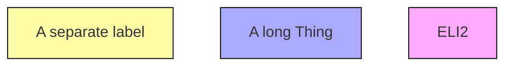

See the law pages: [humanities/law](/humanities/law/), [sociology/law](/science/sociology/law/)

**Discussion Points**
- Rules and Policies
- Computation Policies
- Ontology and Epistemology
  - The objects we are operating on, e.g. legal definitions
  - What can be known and with what certainty

**Sources**

http://logic.stanford.edu/complaw/readings/rules_as_code.pdf

European Legislative Identifier - ELI [^springer]
Europoean Case Law Identifier - ECLI [^springer]

[^springer]: https://link.springer.com/article/10.1007/s10506-021-09282-8

FOLIO - https://openlegalstandard.org/

Computational Law - https://arxiv.org/html/2503.04305v1

List of Ontologies - https://github.com/Liquid-Legal-Institute/Legal-Ontologies

https://www.oasis-open.org/
https://serviceinnovationlab.github.io/projects/legislation-as-code/
https://www.edmondok.gov/DocumentCenter/View/5450/Ordinance-3868-Chickens?bidId=
https://library.municode.com/ok/edmond/codes/code_of_ordinances?nodeId=COOR_TIT7AN_CH7.09AN

modal logic
  --> propositional logic
  --> predicate logic

[^stanford-logic]: https://plato.stanford.edu/entries/logic-modal/
[^wiki-logic]: https://en.wikipedia.org/wiki/Modal_logic
[^utm-logic]: https://iep.utm.edu/modal-lo/


