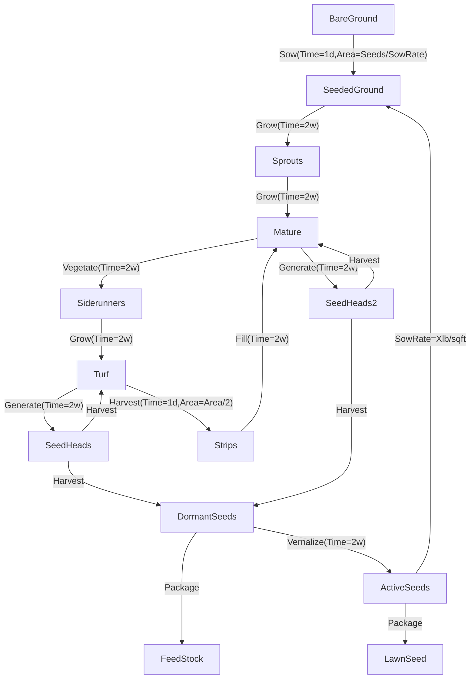

### Market Research

| Species | Seed Price ($/lb) | Sod Price ($/sqft) | Sow Rate (lb/sqft) | Cycle |
|---|---|---|---|---|
| Fescue[^fescue-price] | ? | ? | 4-10/1000 | T1 |
| Rye[^rye-price] | ? | ? | 8-10/1000 | T1 |
| Kentucky Blue[^kentucky-price] | - | - | 2-5/1000 | T1 |
| Bermuda[^bermuda-price] | 8.00 | 0.50-0.75 | 3-4/1000[^sow-rates] | T1 |
| Buffalo | 70/2,140/5,630/25[^buffalo-price] | /-/ | 2-3/1000[^sow-rates] | T1 |
| Blue[^blue-price] | 14.00 | 0.50-0.75 | 0.5 | T1 |
| Blue Grama | - | / - / | | |
| Flowering Blend | 13/1,50/5[^flowering-price] | - | /1000 | T1 |
| Centipede | 25/1,48/2,120/5[^centipede-price] | - | 1-2/1000[^sow-rates] | T1 |
| Zoysia | - | - | 1-2/1000[^sow-rates] | T1 |

T1: Require vernalizing before reseeding

[^centipede-price]: [outsidepride.com centipede grass](https://www.outsidepride.com/seed/grass-seed/centipede-grass-seed.html)
[^fescue-price]: fescue
[^rye-price]: rye
[^kentucky-price]: kentucky
[^bermuda-price]: bermuda
[^buffalo-price]: [outsidepride.com buffalo grass](https://www.outsidepride.com/seed/grass-seed/Buffalo-Grass-Seed/buffalo-grass-seed.html)
[^blue-price]: blue
[^flowering-price]: [outsidepride.com flowering blend](https://www.outsidepride.com/seed/grass-seed/mixtures-different-species/xeriscape-flowering-lawn-seed-mix.html)
[^sow-rates]: [outsidepride.com](https://www.outsidepride.com/seed/grass-seed/Lawn-Menu/Planting-Rates/?srsltid=AfmBOoppHt3rvVCxDArIzNtt3PDQYfevJtmgqufK9-gxBnPtne0hs3qn)

### Methods

The overall process consists of first establishing a turf patch which can then be harvested and regenerated reliably over years. Weed management is most difficult is the beginning, but a mature patch will crowd out competitors by taking up root space and sunlight. A mature patch can be harvested in a way that leaves behind strips which will fill the harvested area with siderunners, meaning any harvested seed can be reinvested to establish new patches or sold. Refilling the harvested areas with new soil is necessary as well as weeding the now barren areas while the patch retakes them.



[^youtube-0]: St Augustine Sod - https://www.youtube.com/watch?v=qlVMFU27Twc
[^youtube-1]: This old house - https://www.youtube.com/watch?v=QYYIvizZFhg
[^youtube-2]: How to Start a Successful Sod Farm - https://www.youtube.com/watch?v=cB8zBFw-ods
[^youtube-3]: How do Sod Farms Work - https://www.youtube.com/watch?v=1Dh_8FWk9n0
