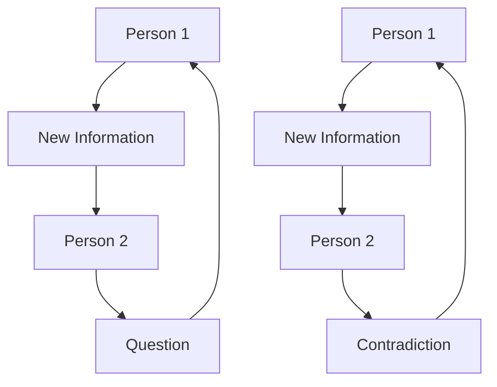

The term "human" is extremely dubious. We claim to give special rights to our fellow human beings, because all humans deserve dignity, respect, blah, blah, blah.

If we're going to humor the idea of humans, we need to carefully distinguish. There are fundamental differences between humans and vermin that result in a wide variety of different behaviors.

## Vermin Are as Vermin Do

A human, when presented with new information, feels compelled to investigate that information as potentially useful.

Vermin usually feel threatened when presented with new information, especially when it conflicts with their preconceptions of reality; disturbingly, even just not knowing something can be considered a preconception – the so-called "know-it-all" who can't fathom some fact might exist outside their head, assuming instead that it must be fictitious.



## What to Do?

The first step in any genocide is dehumanizing the target population. Fortunately, most vermin have already forfeit their humanity, which means they've dehumanized themselves, allowing them to be removed without good people needing to commit the "wrong" of dehumanizing a "human".

