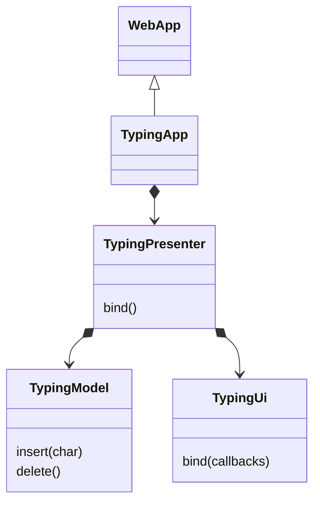

Here you can do some typing practice!

  <!-- Words Here -->

Features:
- Type from excerpts
- Save performance
- View performance over time

```mermaid

classDiagram
  class WebApp {

  }
  class TypingApp {

  }
  WebApp <|-- TypingApp
  class TypingUi {
    bind(callbacks)
  }
  class TypingPresenter {
    bind()
  }
  class TypingModel {
    insert(char)
    delete()
  }

  TypingPresenter *--> TypingModel
  TypingPresenter *--> TypingUi

  TypingApp *--> TypingPresenter

```

