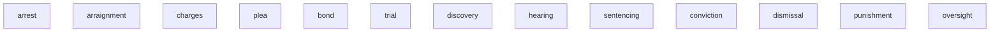

Law as a practice and discipline 

Contrast with [law as a science](/science/sociology/law/)

## Areas of Study

Multistate Bar Exam

- Constitutional Law
- Civil Procedure
- Tort (Harm)
- Contracts
- Criminal Law and Procedure
- Evidence
- Real Property

[^mbe]: https://www.ncbex.org/exams/mbe

Each state has its own full exam:
Oklahoma - https://www.okbbe.com/home

Multistate Essay Exam


[^mee]: https://www.ncbex.org/exams/mee


### Civil Procedure

```mermaid
%% Civil Procedural Flow
graph

```

### Tort

Civil violation

[^wiki-tort]: https://en.wikipedia.org/wiki/Tort

### Real Property


### Constitutional Law


### Contracts


### Criminal Law and Procedure



### Evidence

