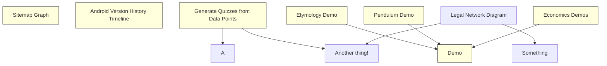
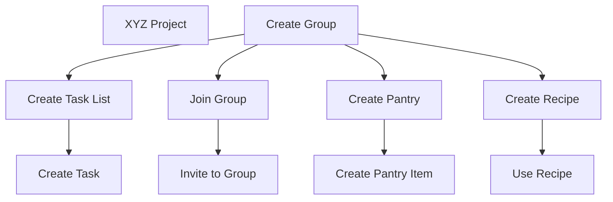

These are project issues, linked from other pages where they are relevant.

**Table of Contents**{: .no_toc}
1. Generate TOC here
{:toc}

## Timeline Diagrams
- Visualize Timeline with data mapped to events
- class event
  - String label
  - DateTime when
- function map
  - obj input
  - returns event

```dates

map(obj) -> {
  label: obj.version + obj.name,
  time: obj.released
}

- version: 1.0
  name: alpha
  released: 1990-01-01
- version: 2.0
  name: beta
  released: 1990-01-01
- version: 3.0
  name: cupcake
  released: 1990-01-01
  more-fields: []

```

## Sitemap Graph
- Fix sitemap page
- Add leaf/branch toggle
- group subdomains
- experiment with hypergraph where domains contain subdomains as hyperedges

## Android Version History Timeline
- Build history of android versions
- display as diagram
- [depends on](#timeline-diagrams)

## Computing History
- build history of major computing events
- display as diagram
- [depends on](#timeline-diagrams)

## Internet History
- build history of major internet events
- display as diagram
- [depends on](#timeline-diagrams)

## Clean Up Todos
- Add Issue Links to existing TODO notes

## Symplectic Demo
- use simple pendulum as phase-state for symplectic manifold demo
- [depends on](#demos)

## Topic Demo
- spatial representation/exploration of conceptual space in-line with Aristotle's original coinage
- build n-dimensional space of topics based on distance/relatedness/hierarchy
- [related to](#topology-demo)
- [depends on](#demos)

## Example Democracy
- Break down primary argument in https://www.reddit.com/r/CapitalismVSocialism/comments/lhw4p4/problems_with_the_tyranny_of_the_majority/

## Economics Demos
- continue [dot world](/science/sociology/dot-world.mjs) simulation
- competition of jobs
- differing skill levels
- stores set prices based on demand
- stores buy from distributers
- distributers set prices based on demand
- manufactuers set prices based on demand
- variety of pricing policies
  - based on prior day demand
- [depends on](#demos)

## Etymology Demo
- chart lemmas and their senses across time from PIE
- [depends on](#demos)

## Pendulum Demo
- allow selecting different integrators to demonstrate numerical instability
- display phase-space for symplectic manifold reference
- [depends on](#demos)

## Legal Network Diagram
- associate efforts with regions
- 

## Overview






