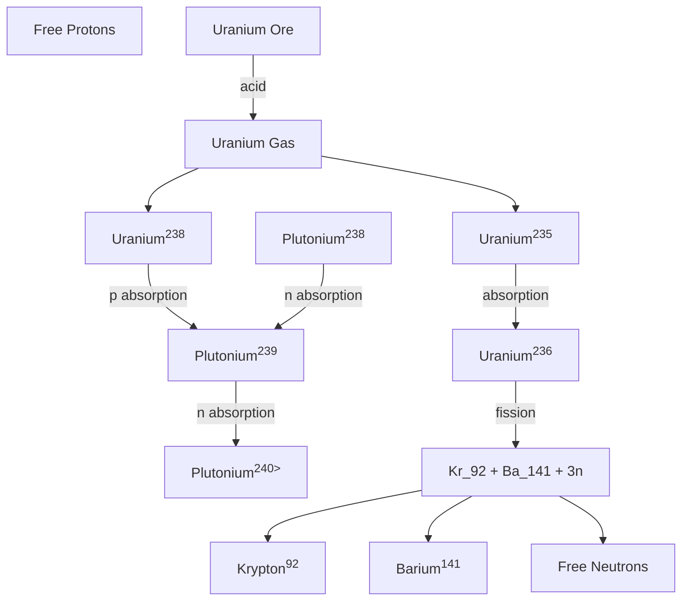

Nuclear chemistry is the study of the properties and interactions of nuclear isotopes of chemical elements.

```mermaid

graph

  n[Free Neutrons]
  p[Free Protons]
  Kr_92[Krypton<sup>92</sup>]
  Ba_141[Barium<sup>141</sup>]
  U_235[Uranium<sup>235]
  U_236[Uranium<sup>236]
  U_238[Uranium<sup>238]
  P_238[Plutonium<sup>238]
  P_239[Plutonium<sup>239]
  P_240[Plutonium<sup>240>]

  U_ore[Uranium Ore] --acid--> U_gas[Uranium Gas]
  U_gas --> U_235
  U_gas --> U_238

  U_235 --absorption--> U_236
  U_236 --fission--> U_236_fission_products[Kr_92 + Ba_141 + 3n]
  U_236_fission_products --> Kr_92
  U_236_fission_products --> Ba_141
  U_236_fission_products --> n

  
  U_238 --p absorption--> P_239

  P_238 --n absorption--> P_239
  P_239 --n absorption--> P_240

```

