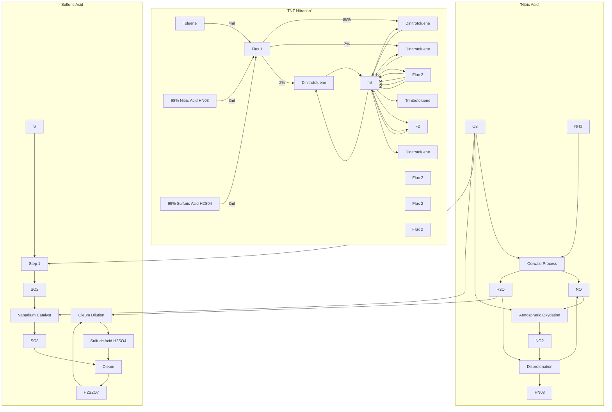

```mermaid

graph

  NO[NO]
  O2[O2]
  NO2[NO2]
  H2SO4[Sulfuric Acid H2SO4]

  T[Toluene]
  Nit[98% Nitric Acid HN03]
  Sul[99% Sulfuric Acid H2S04]

  subgraph 'TNT Nitration'
    F1[Flux 1]
    T --4ml--> F1
    Nit --3ml--> F1
    Sul --3ml--> F1
    F1 --2%--> DNT_0
    F1 --96%--> DNT_1
    F1 --2%--> DNT_2

    DNT_0[Dinitrotoluene]
    DNT_1[Dinitrotoluene]
    DNT_2[Dinitrotoluene]

    F2_0[Flux 2]
    DNT_0 --xml--> F2_0
    F2_0 --xml--> DNT_0
    F2_0 --xml--> DNT_1
    F2_0 --xml--> DNT_2
    F2_0 --xml--> TNT
    F2_1[Flux 2]
    
    F2_2[Flux 2]
    DNT_1 --xml--> F2
    F2_3[Flux 2]
    DNT_2 --xml--> F2
    F2 --xml--> DNT_3

    DNT_3[Dinitrotoluene]

    TNT[Trinitrotoluene]
  end

  subgraph 'Nitric Acid'
    Ost[Ostwald Process]
    NH3 --> Ost
    O2 --> Ost
    Ost --> NO
    Ost --> H2O

    AtmosOx[Atmospheric Oxydation]
    NO --> AtmosOx
    O2 --> AtmosOx
    AtmosOx --> NO2

    Dispro[Disprotonation]
    NO2 --> Dispro
    H2O --> Dispro
    Dispro --> HN03
    Dispro --> NO
  end

  subgraph Sulfuric Acid
    SA_S1[Step 1]
    S --> SA_S1
    O2 --> SA_S1
    SA_S1 --> SO2

    SA_S2[Vanadium Catalyst]
    SO2 --> SA_S2
    O2 --> SA_S2
    SA_S2 --> SO3

    Ol[Oleum]
    H2SO4 --> Ol
    SO3 --> Ol
    Ol --> H2S2O7

    OlDil[Oleum Dilution]
    H2S2O7 --> OlDil
    H2O --> OlDil
    OlDil --> H2SO4
  end

```


