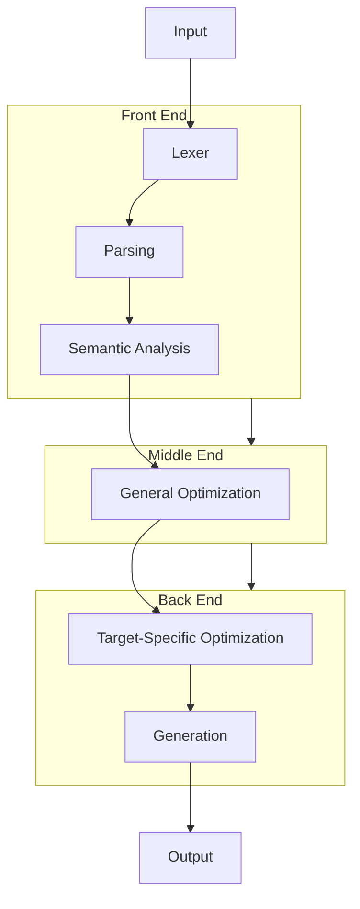

The demos on this site will focus on explaining how compilers and interpretters work, but as a consequence of end-to-end demonstrations, we will likely produce at least one, complete working compiler.

## Modern Three Stage Compilers

### Front End
Lexing - converts some input character sequence into a token sequence.
Parsing - converts a token sequence into an intermediate representation (IR), usually an abstract syntax tree (AST).
Semantic Analysis - validates the IR.

### Middle End
Transformations/Optimization - as optimizations come with trade-offs, the specific transformation needs some context to inform

### Back End
Generation - The IR is converted to the final output, usually a machine language for bare metal execution, intermediate instruction set for platform-independent bytecode execution


