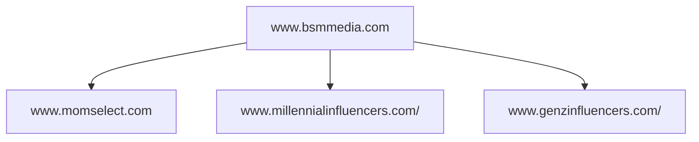

A blog was originally understood as a web log[^1] of personal activity or projects and interests. "Mommy blogs" had a moment for a while and are still a popular source of parenting or housekeeping information, with total readership in the millions[^2].

[^1]: https://www.etymonline.com/word/blog
[^2]: https://www.bsmmedia.com/marketing-muscle-of-mom-bloggers/#:~:text=45%20million%20women

TODO: research BSM Media

