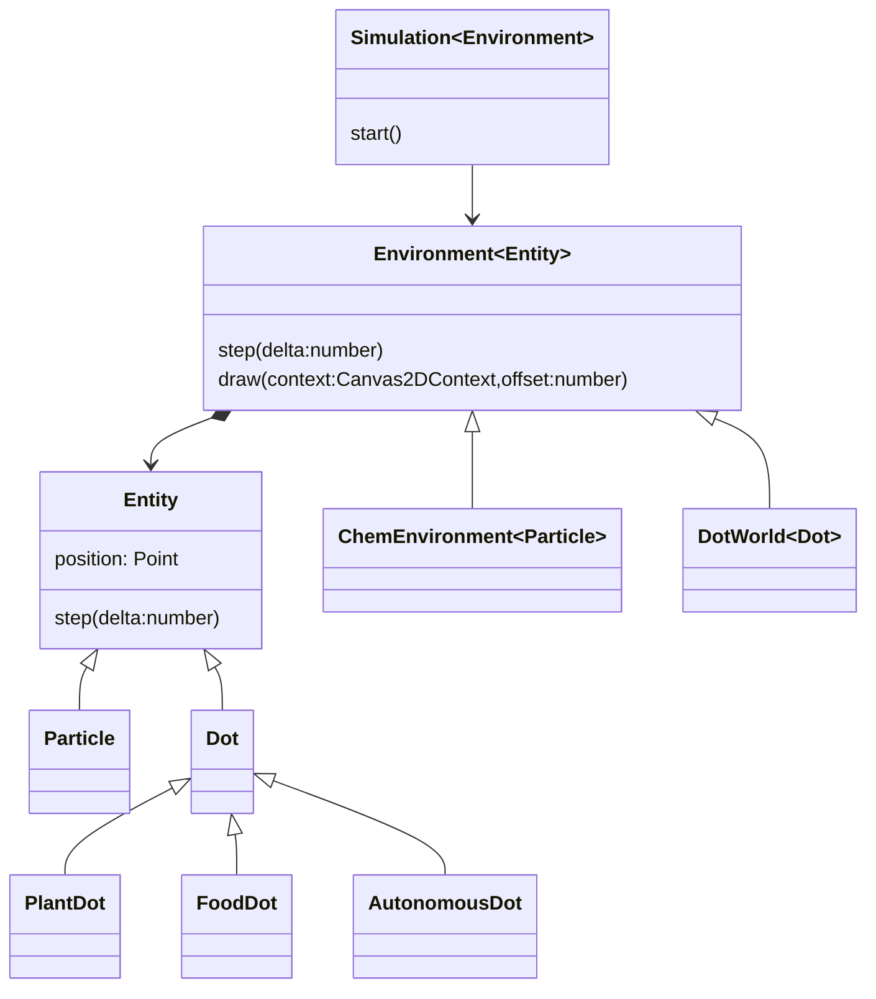

```mermaid

classDiagram

  class Entity {
    position: Point
    step(delta:number)
  }

  class Environment~Entity~{
    step(delta:number)
    draw(context:Canvas2DContext,offset:number)
  }
  Environment *--> Entity

  class Simulation~Environment~{
    start()
  }

  class Particle
  Entity <|-- Particle
  class ChemEnvironment~Particle~
  Environment <|-- ChemEnvironment

  Simulation --> Environment
  
  class Dot
  Entity <|-- Dot
  class DotWorld~Dot~ {

  }
  Environment <|-- DotWorld

  class PlantDot
  Dot <|-- PlantDot
  class FoodDot
  Dot <|-- FoodDot
  class AutonomousDot
  Dot <|-- AutonomousDot

```

