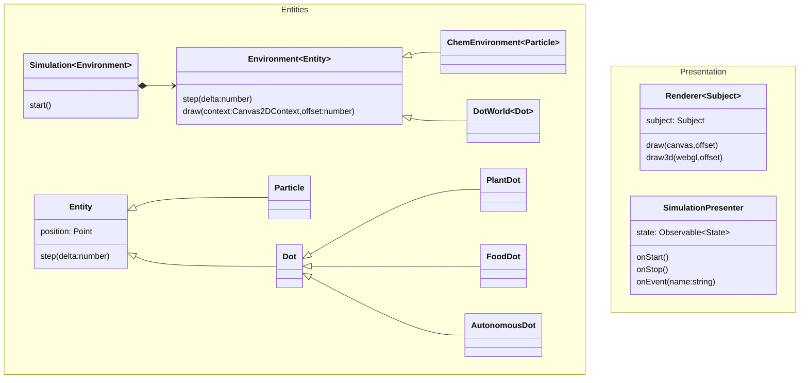

## Integrators

TODO: [Pendulum Demo](/issues#pendulum-demo)

```mermaid

classDiagram

namespace Entities {

  class Entity {
    position: Point
    step(delta:number)
  }

  class Environment~Entity~{
    step(delta:number)
    draw(context:Canvas2DContext,offset:number)
  }

  class Simulation~Environment~{
    start()
  }

  class Particle
  class ChemEnvironment~Particle~

  
  class Dot
  class DotWorld~Dot~ {

  }

  class PlantDot
  class FoodDot
  class AutonomousDot
}
Simulation *--> Environment
Environment <|-- ChemEnvironment
Entity <|-- Particle
Environment <|-- DotWorld
Entity <|-- Dot
Dot <|-- PlantDot
Dot <|-- FoodDot
Dot <|-- AutonomousDot

namespace Presentation {

  class Renderer~Subject~ {
    subject: Subject
    draw(canvas,offset)
    draw3d(webgl,offset)
  }

  class SimulationPresenter {
    state: Observable~State~
    onStart()
    onStop()
    onEvent(name:string)
  }
}

```

