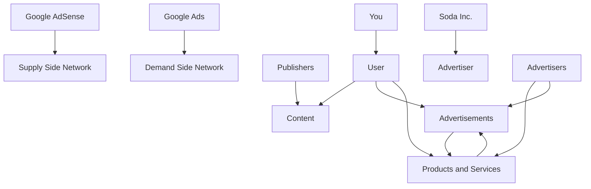

Google Ads provides advertisers access to the demand-side network.

Google AdSense provides publishers access to the supply-side network.

```mermaid

graph TD
  SSN[Supply Side Network]
  DSN[Demand Side Network]

  Publishers[Publishers]
  Content[Content]
  Publishers --> Content

  User[User]
  User --> Content

  Advertiser[Advertiser]
  Products[Products and Services]
  Ads[Advertisements]
  Advertisers --> Products
  Advertisers --> Ads
  Products --> Ads

  User --> Ads
  User --> Products
  Ads --> Products

  GoogAds[Google Ads] --> DSN
  GoogAdSense[Google AdSense] --> SSN

  SodaCorp[Soda Inc.] --> Advertiser

  You --> User

  click GoogAds href "https://www.google.com" "Google Search"
```


