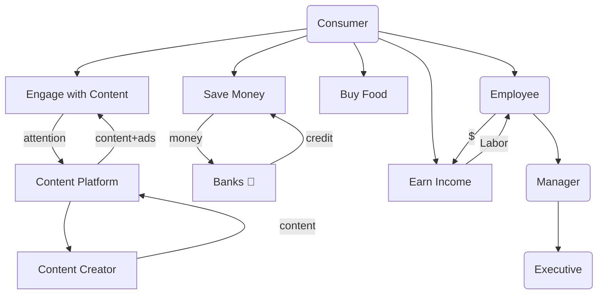

Let's look at several different scopes and scales.

```mermaid

graph TD
    cons(Consumer)
    empl(Employee)
    mngr(Manager)
    exec(Executive)

    cons --> empl
    empl --> mngr
    mngr --> exec

    cons --> save[Save Money]
    save --money--> bank[Banks 🏦]
    bank --credit--> save

    cons --> earn[Earn Income]

    earn --"Labor"--> empl
    empl --"$"--> earn

    cons --> buy[Buy Food]
    cons --> engage[Engage with Content]

    engage --attention--> platform[Content Platform]
    platform --"content+ads"--> engage

    platform --> creator[Content Creator]
    creator --content--> platform
```
{: .language-mermaid }


