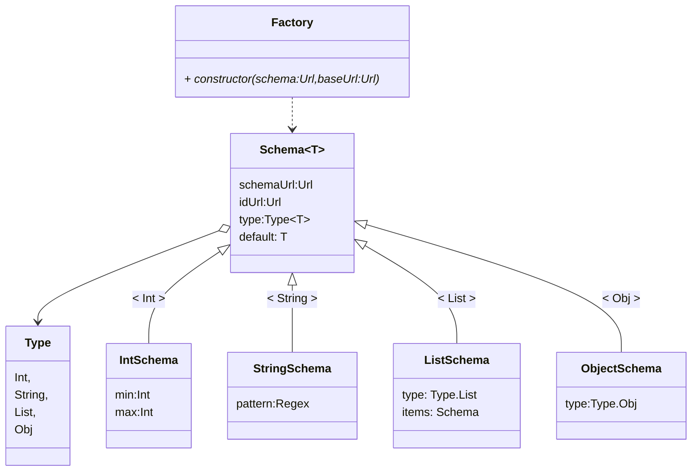

## Graph Animation Lib

- describe graph elements
- imperative
  - create elements
    - attributes
    - events trigger functions
  - modify attributes
  - remote elements
- declarative
  - elements
    - attributes
    - events trigger pure functional state reducers
  - animations/transitions
  - keyframes

```
<svg>
  <circle x=0 y=0 width=10 height=10 />
  <rect left=-10 right=-20 top=5 bottom=15 />
  <translation x=50 y=0>
  <rotation theta=45>
    <line x1=4 y1=12 x2=50 y2=55 width=2.5 stroke="red"/>
  </rotation>
</svg>

svg: [
  { circle: {
      x: 0, y: 0, width: 10, height: 10
  }},
  { rect: {
    left: -10, right=-20,
    top=5, bottom=15
  }},
  { filter: {

  }},
  { translation: {
    x=50,y=0,
    elements: [

    ]
  }},
  { rotation: {
    theta: 45,
    elements: [
      { line: {
        x1: 4, y1: 12,
        x2: 50, y2: 55,
        width: 2.5,
        color: "red"
      }}
    ]
  }}
]
```



```ts
{
  $schema: 'https://json-schema.org/draft/2020-12/schema',
  $id: 'https://pointyware.org/svg-rect',
  type: 'object',

}
function siteUrl(path:string) {
  return 'https://pointyware.org/' + path;
}
const schemaFactory = Schema.Factory({
  schema: JsonSchema.Drafts.Schema_2020_12,
  baseUrl: siteUrl('')
})
const zeroIntProp = Schema.Property()
  .setTypeInt()
  .default(0)
const rect = schemaFactory.draft('svg-rect')
  .setTypeObject()
  .properties({
    left: zeroIntProp,
    right: zeroIntProp,
    top: zeroIntProp,
    bottom: zeroIntProp
  }).build();
const line = schemaFactory.draft('svg-line')
  .setTypeObject()
  .properties({
    x1: zeroIntProp,
    y1: zeroIntProp,
    x2: zeroIntProp,
    y2: zeroIntProp
  }).build()
const translation = schemaFactory.draft('svg-translation')
  .setTypeObject()
  .properties({
    x: zeroIntProp,
    y: zeroIntProp
  }).build()
const rotation = schemaFactory.draft('svg-rotation')
  .setTypeObject()
  .properties({
    x: zeroIntProp,
    y: zeroIntProp,
    theta: zeroIntProp
  })
```
