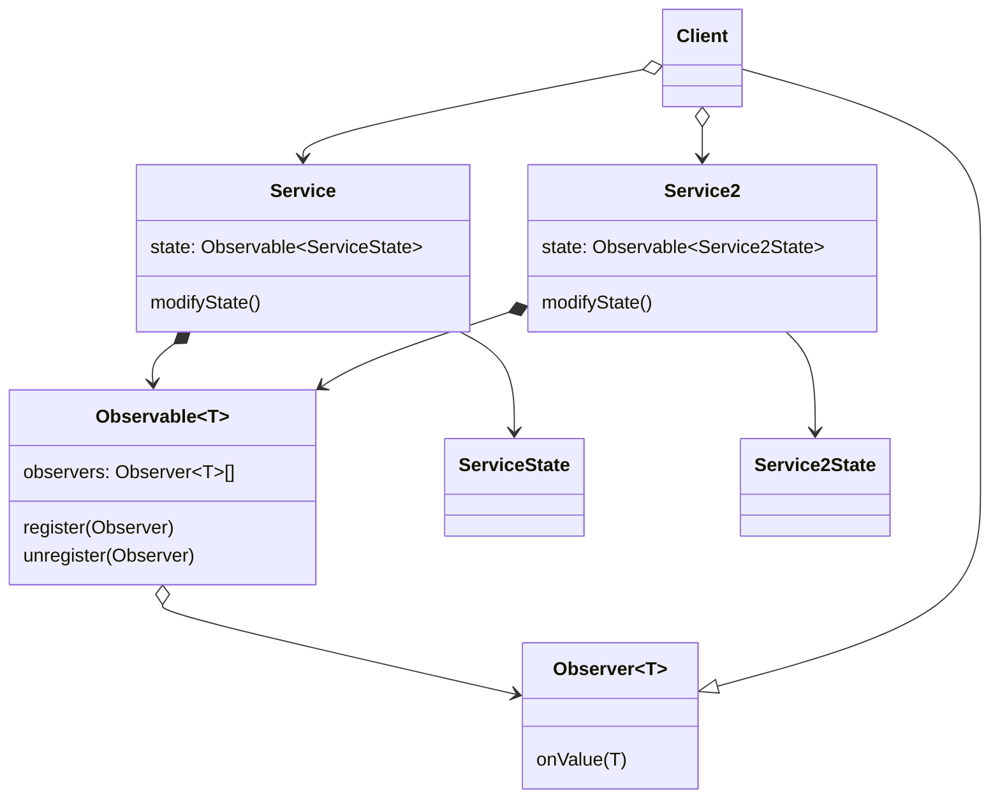
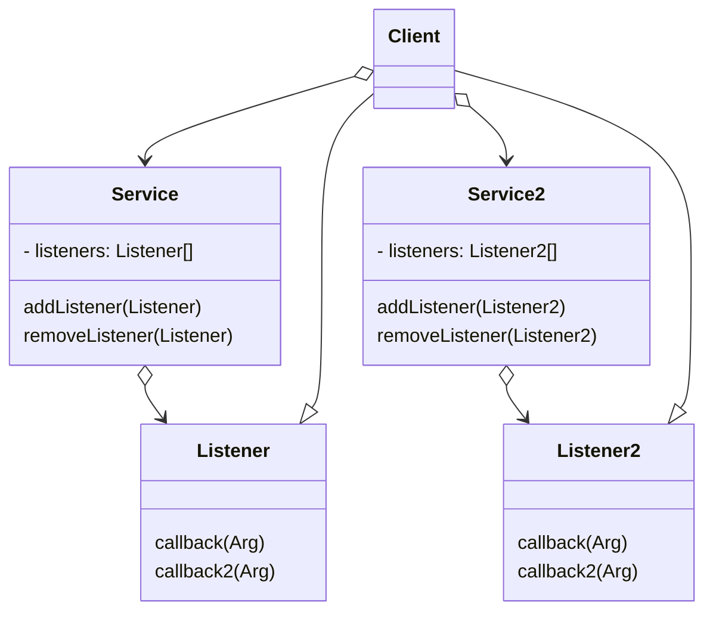

The observer pattern can be used to generally support the Output Ports concept found in Uncle Bob's Clean Architecture.

```mermaid

classDiagram

  class Observer~T~ {
    onValue(T)
  }
  class Observable~T~ {
    register(Observer)
    unregister(Observer)
    observers: Observer~T~[]
  }
  Observable o--> Observer

  class ServiceState
  class Service {
    state: Observable~ServiceState~
    modifyState()
  }
  Service --> ServiceState
  Service *--> Observable

  class Service2State
  class Service2 {
    state: Observable~Service2State~
    modifyState()
  }
  Service2 --> Service2State
  Service2 *--> Observable

  class Client {

  }
  Client o--> Service
  Client o--> Service2
  Client --|> Observer
```

```mermaid

classDiagram

  class Listener {
    callback(Arg)
    callback2(Arg)
  }
  class Service {
    addListener(Listener)
    removeListener(Listener)
    - listeners: Listener[]
  }
  Service o--> Listener

  class Listener2 {
    callback(Arg)
    callback2(Arg)
  }
  class Service2 {
    addListener(Listener2)
    removeListener(Listener2)
    - listeners: Listener2[]
  }
  Service2 o--> Listener2

  class Client {

  }
  Client o--> Service
  Client o--> Service2
  Client --|> Listener
  Client --|> Listener2
```

