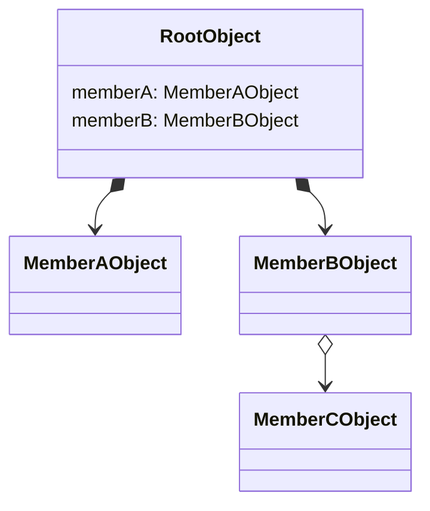

Representational State Transfer (ReST) is an API design pattern that abstracts a system behind an API, returning any mutated state in each request response.

### Theory

RESTful APIs are meant to represent resources and their manipulation
A fundamental decision in the manipulation of different properties is their data type, or structure.

Since POST, GET, PUT/PATCH, DELETE correspond to Create, Read, Update, Delete, I think it makes sense to design an API by thinking about each endpoint like a resource and trying to assign a type that gives better semantic reasoning to each of the HTTP methods.

