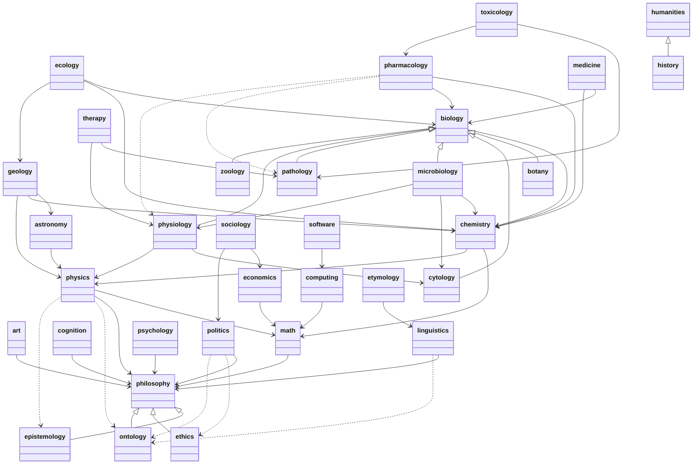

  <canvas id='sitemap-canvas' class='demo-view' width=400 height=400></canvas>
  

     
    <button id='button-time-control'>Start</button>
    <button id='button-save'>Save</button>
    <label for='range-repulsion-force'>Repulsion</label>
    <input id='range-repulsion-force' type='range' min=0 max="1E5">
    <label for='range-spring-length'>Spring Length</label>
    <input id='range-spring-length' type='range' min=0 max=100>
    <label for='range-spring-force'>Spring force</label>
    <input id='range-spring-force' type='range' min=0 max=100>
    <label for='range-center-force'>Center force</label>
    <input id='range-center-force' type='range' min=0 max=2 step=any>
    <label for='range-drag-restitution'>Drag</label>
    <input id='range-drag-restitution' type='range' min=0 max=1 step=any>
    <label for='checkbox-debug'>Debug</label>
    <input id='checkbox-debug' type='checkbox'>
  


